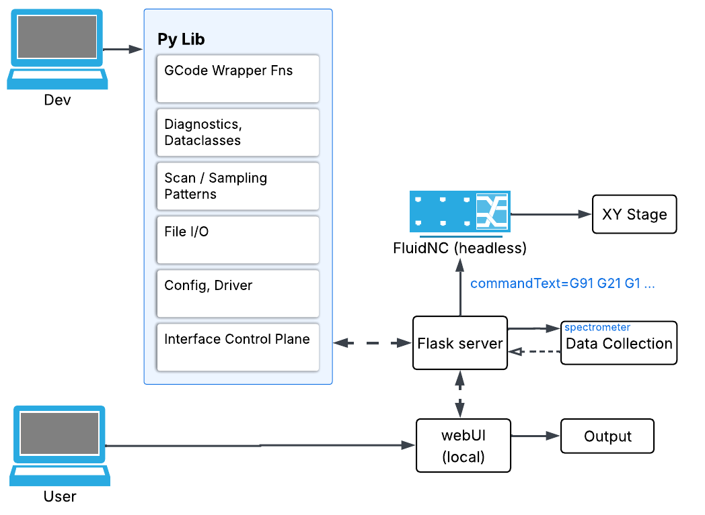

## what this
python c&c for interfacing with 
* FluidNC (jackpot v3) via HTTP to local AP
    * maybe without losing internet this time
* OceanView's API (TBD - [USB 650 unsupported by seabreeze](https://sourceforge.net/p/seabreeze/tickets/32/) ([and py by ext](https://github.com/ap--/python-seabreeze/issues/47)))
    * [OmniDriver 2.56](https://github.com/aphalo/romnidriver) (Java)
    * OceanDirect?
        * looks like replacement to OmniDriver, unknown if USB 650 supported (signs point to no, but need test firsthand...)
            * python supported
            * have api files, what else is missing (i.e. what's the $600 for?)
* saving spectral data to a diagnostic cube thing
* recreation of spatial relationships from point-based scan data
* ML: preproc, classification via SVC

eventually
* flask server backend
* local web UI so non-CS people aren't forced to use this inspired mess

## does it work yet
* no lol
